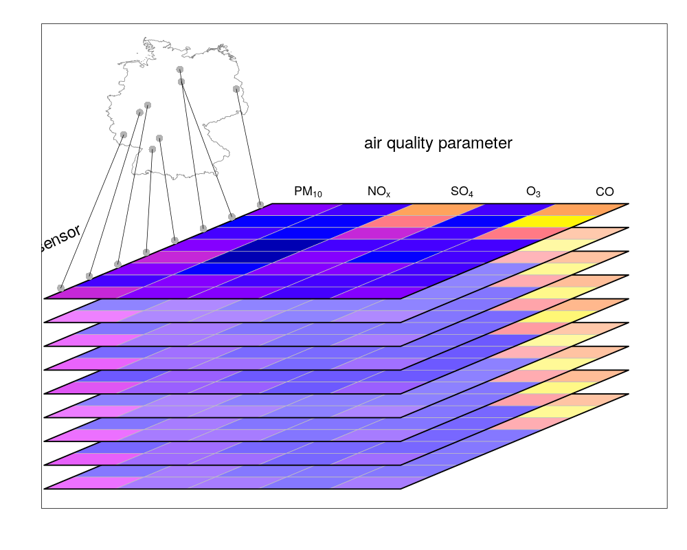
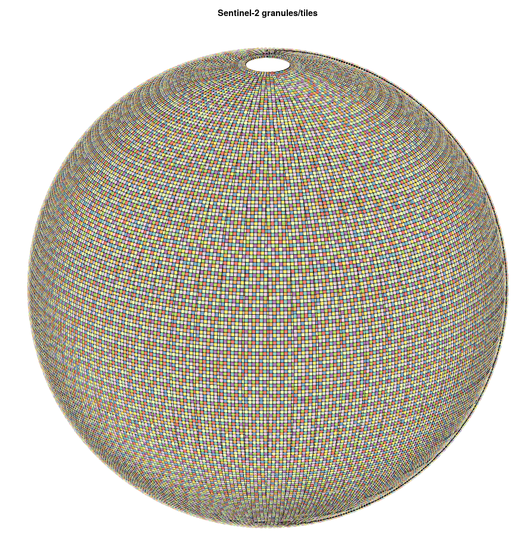
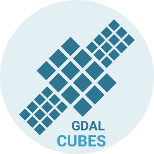

```{r setup, include=FALSE}
knitr::opts_chunk$set(echo = FALSE)
```

## What are data cubes?

- They are annotated **array data**.
- Arrays map from $n$ dimensions to $p$ attributes:
$$(D_1,D_2,...,D_n)\rightarrow (A_1,A_2,...,A_p)$$
- array dimensions are enumerated sets, and may
    - represent a set of entities (cities, persons, species, spectral bands)
    - discretize a continuous variable, such as 
        - spatial _dimension_, 
        - time, 
        - time-of-day, 
        - frequency or wavelength, 
        - duration (e.g., time-to-forecast)

## "Cube": 

We use the word _cube_ short for

- "real" cube: three dimensions
- more than three dimensions: hypercube
- two dimensions: matrix, raster

a special case is:

- one dimensional cube: table with records (`data.frame`, `tibble`)

## "Spatial" data cube

Cube dimensions can refer to spatial dimensions in several ways:

- each continuous spatial dimension (x, y, z) maps to a **single** cube dimension (**raster** data cubes), e.g. regular grids
   - $c(i) = o + (i-1) \times \delta, \ \ i = 1,2,...,n$
   - index space is continuous: integer $i$ implies $[i,i+1)$
   - this means that every coordinate value maps to a unique index (unlike polygons)

- **all** spatial dimensions map to a single cube dimension (**vector** data cubes)
    - cube dimension is a set of points/lines/polygons
    
- combinations of these: e.g. origin-destination matrices


----

```{r,out.width='100%'}
knitr::include_graphics('cube1.png')
```

----

```{r,out.width='100%'}
knitr::include_graphics('cube2.png')
```

----

```{r,out.width='100%'}
knitr::include_graphics('cube3.png')
```

----

```{r,out.width='100%'}

```

## Raster - vector conversion

From raster to vector:

- polygons or points are given:
    - sample ("extract")
    - aggregate, e.g. mean or sum over polygon
- polygons or lines are the result:
    - polygonize
    - contour

From vector to raster:

- (points/polygons:) rasterize
- (point sample:) interpolate 
- (point pattern:) density 

------ 

## Raster types

```{r echo=FALSE}
suppressPackageStartupMessages(library(stars))
x = 1:5
y = 1:4
d = st_dimensions(x = x, y = y, .raster = c("x", "y"))
m = matrix(runif(20),5,4)
r1 = st_as_stars(r = m, dimensions = d)

r = attr(d, "raster")
r$affine = c(0.2, -0.2)
attr(d, "raster") = r
r2 = st_as_stars(r = m, dimensions = d)

r = attr(d, "raster")
r$affine = c(0.1, -0.3)
attr(d, "raster") = r
r3 = st_as_stars(r = m, dimensions = d)

x = c(1, 2, 3.5, 5, 6)
y = c(1, 1.5, 3, 3.5)
d = st_dimensions(x = x, y = y, .raster = c("x", "y"))
r4 = st_as_stars(r = m, dimensions = d)

grd = st_make_grid(cellsize = c(10,10), offset = c(-130,10), n= c(8,5), crs=st_crs(4326))
r5 = st_transform(grd, "+proj=laea +lon_0=-70 +lat_0=35")

par(mfrow = c(2,3))
r1 = st_make_grid(cellsize = c(1,1), n = c(5,4), offset = c(0,0))
plot(r1, main = "regular")
plot(st_geometry(st_as_sf(r2)), main = "rotated")
plot(st_geometry(st_as_sf(r3)), main = "sheared")
plot(st_geometry(st_as_sf(r4, as_points = FALSE)), main = "rectilinear")
plot(st_geometry((r5)), main = "curvilinear")
```

## R package `raster`

- is legacy, well understood, scales (automatically), powerful
- "limits" data size to data on (local) disk; will auto-chunk
- only implements _regular_ raster, or a _stack_ of these
- stack can be time-related
- pixels are scalar, real-valued (custom mimicing factors)

--- 

- Is anything is wrong with R's native `array`? No!
- dimensions can be named, dimension values labeled:
```{r echo=TRUE}
array(1:8/8, c(2,2,2), dimnames = list(dim_1=c("a","b"), dim_2=c("p", "q"), 
     dim_3=c("x", "y")))
```

----

- but labels can only be `character`
- `dpyr::tbl_cube` improves on this, but still only accepts vectors, not handling regular, rectilinear boundaries, CRS, units, sheared/rotated, curvilinear, ...
- arrays can only (sensibly) be atomic: no records with mixed fields
- arrays are in-memory (which **may** at some point change, e.g.~using `ALTREP`)

## R package `stars`

- a `stars` object is a _set_ (`list`) of arrays with possibly varying type (numeric, integer, `factor`, `logical`, `character`, `list`)
- uses R's native arrays for that: all `array` Ops work (pixel math)
- supports arrays with measurement units and time stamps (throug GDAL, libnetcdf)
- has a `dimensions` attribute "table"
- does everything in memory, unless you use `stars_proxy`, which does nothing in memory
- lets you define arbitrary number of dimensions
- slice \& dice with `[`, or `filter`
- map/reduce with `st_apply`: apply a function to a (set of) dimension(s)
- `aggregate` for spatial / temporal aggregations
- supports rectilinear (all dims), rotated, sheared, and curvilinear grids (raster), and simple features (vector)

## R package `stars` (2)

- implements raster (GDAL, netcdf) and vector (`sfc`) data cubes
- full support for PROJ coordinate reference systems
- time support: `POSIXct`, `Date`, as well as `PCICt` (360, 365, noleap)
- integration with some tidyverse verbs (`filter`, `select`, `mutate`, `geom_stars`)
- integrates with `gstat` (spatial, spatiotemporal geostatistics)

----

```{r echo=TRUE}
library(stars)
tif = system.file("tif/L7_ETMs.tif", package = "stars")
(x = read_stars(tif))
```

----

```{r echo=TRUE}
plot(x)
```

## `stars_proxy` objects

- contain pointers to the data (file, URL), which by no means uniquely defines an array
- use a strategy to go through them (chunking: currently only spatial)
- are lazy: only compute when data is requested
- can read downsampled arrays (e.g. to `plot`): optimises execution order of call stack
- can time-compose e.g. a time stack of NetCDF files, with a time slice in each file  

---

```{r echo=TRUE}
granule = system.file("sentinel/S2A_MSIL1C_20180220T105051_N0206_R051_T32ULE_20180221T134037.zip", package = "starsdata")
base_name = strsplit(basename(granule), ".zip")[[1]]
s2 = paste0("SENTINEL2_L1C:/vsizip/", granule, "/", base_name, ".SAFE/MTD_MSIL1C.xml:10m:EPSG_32632")
(p = read_stars(s2, proxy = TRUE))
object.size(p)
```

---

```{r echo=TRUE}
system.time(plot(p))
```

---

```{r echo=TRUE}
ndvi = function(x) (x[4]-x[3])/(x[4]+x[3])
system.time(plot(st_apply(p, c("x", "y"), ndvi)))
```

## What if data are not nicely aligned in a cube?

- subsequent images have different, consecutive time stamps
- space is not rasterized (e.g., tiles in UTM zones)

--- 

```{r,out.width='100%'}

```

## `gdalcubes`:

- create and process Earth observation data cubes from GDAL image collections
- written by Marius Appel:  [C++](https://github.com/appelmar/gdalcubes),  [R interface](https://github.com/appelmar/gdalcubes_R)
- indexes a set of GDAL-readable files
- "reads" them, by resampling, to a user-defined data cube
- resampling options can be controlled (e.g. nearest, linear, bilinear) in both space and time
- can process this cube, in parallel (e.g., reduce, aggregate)
- writes the resulting data cube to a NetCDF file

```{r fig.align='center'}

```

## openEO : an API for cube processing

- is an H2020 project that develops a modern, open API to connect R, python, javascript and other clients to big Earth observation cloud back-ends in a simple and unified way.
- has (scalar-valued) raster and vector data cubes as its data primitive
- allows map/reduce, aggregation, resampling, user-defined data cubes, all math ops, ..
- allows for UDFs (user-defined functions, e.g. written in Python or R)
- anticipates a federated, heterogeneous cloud big EO data computing landscape (EOSC, DIAS, TEPs/MEPs...)

`stars` is somewhat of a blueprint, and useful client-side, or for server-side UDFs

## Wrapping up:

Get involved: try out stuff

* if you do, don't hesitate to give feedback on r-sig-geo, github issues, or twitter

Further reading:

* the [CRAN landing page](https://cran.r-project.org/package=stars) for `stars` has five vignettes
* Spatial Data Science (with applications in R): [r-spatial.org/book/](https://r-spatial.org/book/)
* my rstudio::conf 2019 talk: [spatial data science in the tidyverse](https://resources.rstudio.com/rstudio-conf-2019/spatial-data-science-in-the-tidyverse)

Finally:

* To make this fly, we only need a video.